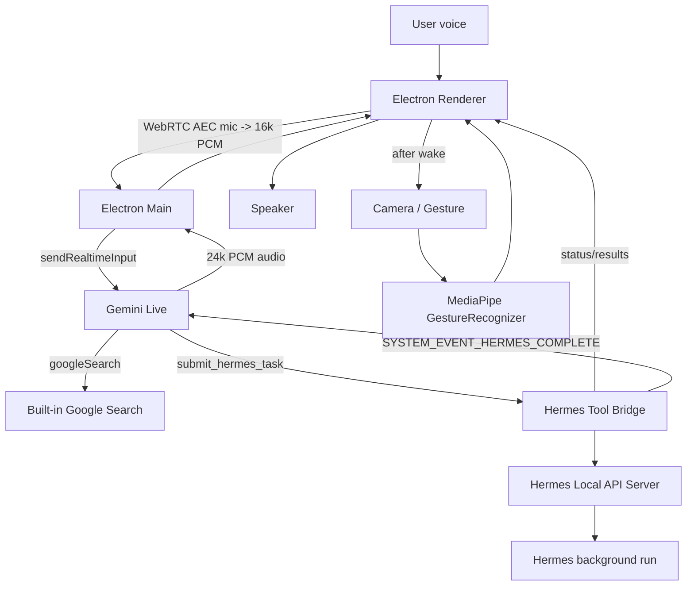

# Iris Current Plan / Architecture

## Core Decision
Use **Electron-native Gemini Live** as the realtime voice manager and **Hermes**
as the worker agent. The Python sidecar remains in the repo as a reference, but
the active app path is:

- Electron renderer captures mic with Chromium/WebRTC echo cancellation.
- Electron main owns the Gemini Live session through `@google/genai`.
- Gemini can use built-in Google Search for quick facts.
- Gemini delegates long-running work to Hermes via the local API server.
- Hermes returns a `run_id` immediately; Iris keeps talking while Hermes works.
- Source/dev workflows are cross-platform (`npm run dev` works on macOS,
  Windows, and Linux).
- First-run onboarding wizard (and a Settings panel) collects the Gemini key,
  Hermes connection, name, voice, and permissions, and writes them to
  `~/.iris/.env` (`%USERPROFILE%\.iris\.env` on Windows). Manual `.env` editing is
  an optional power-user path; a repo `.env` still works in development.
- Personal context comes from Hermes's own memory files
  (`~/.hermes/memories/USER.md` and `MEMORY.md`), injected into Gemini's system
  prompt so it writes accurate Hermes briefs.

## Architecture

## Implementation Shape
- `electron/main.mjs`: Gemini Live session, tool declarations, Hermes API bridge, Hermes polling + SSE activity stream, completion announcements, audio IPC, config read/write (`~/.iris/.env`), key/Hermes tests, voice preview, and user-context loading from Hermes memory.
- `electron/preload.cjs`: Safe `window.iris` IPC bridge (incl. config get/save, tests, voice preview).
- `src/App.tsx`: Voice UI state, WebRTC mic capture, PCM playback, task reader, gestures, Orbital Deck layout.
- `src/SetupPanel.tsx`: First-run onboarding wizard and Settings panel.
- `src/deck.css`: Dark-only Orbital Deck layout styles.
- `src/useHandControl.ts`: MediaPipe `GestureRecognizer` camera/gesture hook.
- `scripts/run-electron.mjs`: Cross-platform Electron launcher that clears
  `ELECTRON_RUN_AS_NODE` and can start the production build.
- `sidecar/hermes_client.py`: Local Hermes client for `/health`, `/v1/runs`, `/v1/runs/{run_id}/events`, `/stop`, and `/approval`.
- `sidecar/voice_server.py`: Historical Python prototype/reference, not the main runtime path.

## Gemini Tool Design
Declare a small set of tools at session start:

- `check_hermes_status`: fast health check.
- `submit_hermes_task`: submits a Hermes background run and returns immediately with `run_id`.
- `get_hermes_task_status`: checks a run status.
- `stop_hermes_task`: stops an active run.
- `approve_hermes_action`: resolves a pending Hermes approval.

For `gemini-3.1-flash-live-preview`, `submitHermesTask` must not wait for completion. It returns: "started", `run_id`, and a short acknowledgement for Gemini to speak.

## Runtime Flow
1. App boots dark-only with camera/gesture disabled.
2. User presses `W`.
3. Electron main opens Gemini Live.
4. Renderer starts WebRTC microphone capture and streams 16 kHz PCM to Gemini.
5. After wake succeeds, camera/gesture control starts automatically.
6. Gemini speaks the welcome message and listens continuously.
7. User can interrupt while Gemini speaks; playback is flushed on Live interruption events.
8. If the user requests work, Gemini calls `submit_hermes_task`.
9. Hermes progress streams into the Work Stream.
10. On completion, Electron injects `SYSTEM_EVENT_HERMES_COMPLETE` into Gemini so Iris proactively summarizes the result.
11. User presses `S` to sleep; Gemini, mic, playback, and camera/gesture control stop.

## Wake Word Plan
Current control is push-to-wake (`W`) and sleep (`S`). Add local wake word only
after the voice/Hermes loop remains stable.

Preferred wake-word options:
- `node-wakeword`/openWakeWord for free local detection.
- Picovoice Porcupine if you want easier custom wake phrase quality and do not mind an access key.

## First Milestone
Current stable milestone:
- Voice wake/listening works through Electron-native mic capture.
- Gemini Live can respond and handle interruption.
- Hermes background runs appear in Work Stream with markdown reader.
- Camera/gesture starts after wake and supports point/dwell/open-palm/fist controls.
- UI is dark-only Orbital Deck.

## Risks And Mitigations
- Gemini 3.1 synchronous tools: return immediately; never block on Hermes work.
- Hermes API not enabled: detect health failure and show exact `.env` setup required.
- macOS/Windows/Linux mic/camera permissions: request media permissions explicitly.
- Do **not** start camera/MediaPipe on app boot; it can interfere with the voice path. Start it after wake.
- Keep the Gemini Live JS SDK names and model identifiers pinned in README.
- Keep Hermes tasks non-blocking; return `run_id` immediately.
- Keep `.env` ignored and document credentials through `.env.example`.
